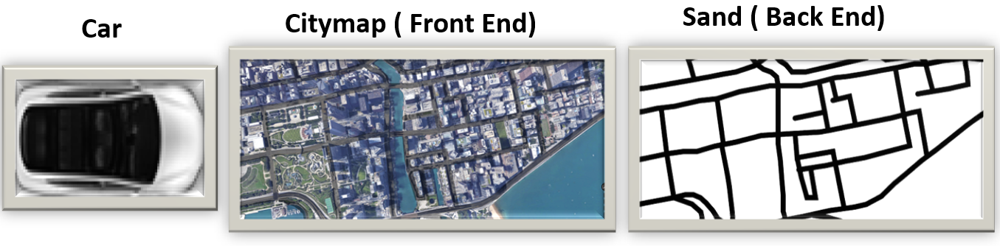
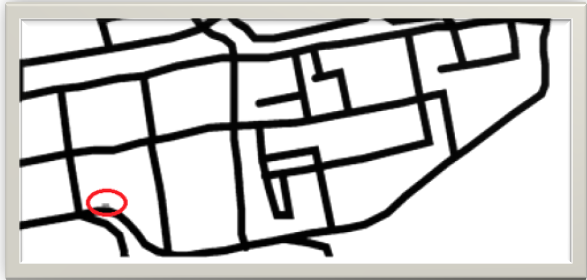
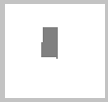
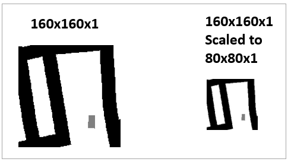
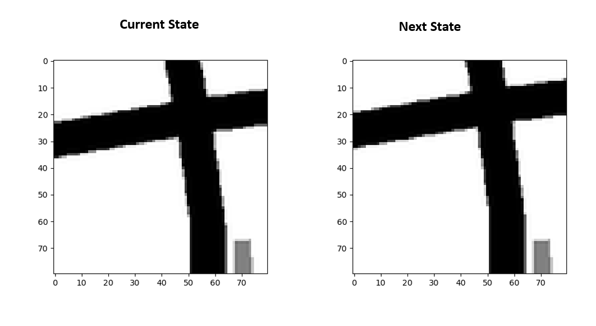
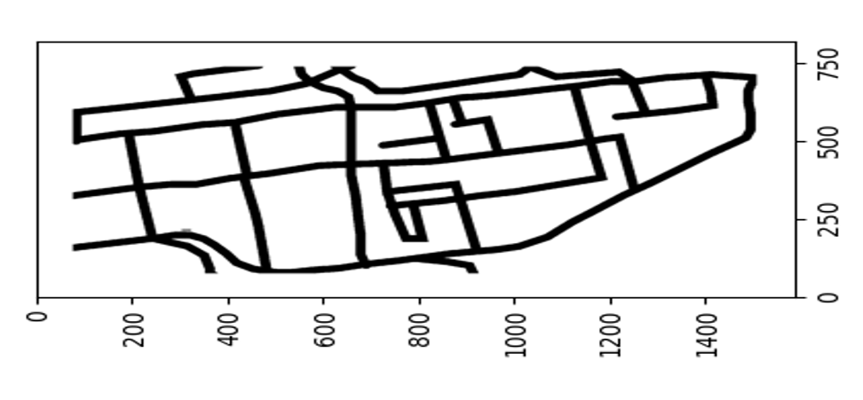

# P2S10
## Self Driving Car- TD3

In this session We are going to train our Car to Self Drive on given track(Citymap) using one of the most powerful and state of the art algorithms in Reinforcement Learning (RL), Twin Delayed Deep Deterministic Policy Gradients (TD3).

Before directly jumping into TD3 training part. First try to understand problem statement carefully. We already solved this problem using Deep Q learning, So I will try to explain through that only.

Here State dimension is 5, consists of Vector ( Sensor_1_Signal, Sensor_2_Signal, Sensor_3_Signal, + Car_Orientation, - Car_Orientation)
Action dimension is 3, consists of Vector ( turn left, go straight, turn right)
(Note: Sensors_1, Sensors_2, Sensors_3 attached to our Car front to sense Sand or Road ahead and Car_Orientations are angles of Car with respect to reference axis)

Please refer following video to see output of Deep Q learning. Only difference- We are moving Baby Elephant inside the Jungle Map. :)
(Rest of things are same as explained above)
https://www.youtube.com/watch?v=2lWoQwJ47mc&feature=youtu.be

Alright! Lets move back to our Self Driving Car using TD3.

Here our State dimension is 80 ( We are going to feed gray scale image of 80x80x1)
Action dimension is 1 (Take action to move car according network output orientation)
Max Action is 1.

Following Steps are followed to implements this:

1) Take Assignment 7 Code and TD3 code for Walker2DBulletEnv-v0 and try to integrate them together-
 Kivy Environment, Input States(Sensor and Orientation), Actions(Turn or Striaght), Rewards from Assignment 7 and replace Deep Q Learning Architecture with TD3 Architecture.
 
2) Hola! Now our car starts moving around the given CityMap (Not on given Road). What We missing- oh Yeah We need to train TD3 Network.(Deep Q Learning was much easier in case fast training and Learning)

As our goal is to feed input state as Image, not Sensor and Orientation information. So I will try to explain rest of steps with input Image state only. Before Proceeding ahead lets illustrate couple of basics.

We will train our Car to follow roads given in Citymap. We will be feeding information to network from Sand Image. Idea to follow Black pixels road, and avoid Sand or white pixels (Non road area)

3) We need to draw a moving car on the Sand, because our network should learn a Player(Car) and Environment (Roads and Sand).
Check our Car (What we draw on Sand) marked in red circle. Note- Road- Black Color, Car- Gray Color and Sand - White Color 

4) Now We need to think, How to feed a view around our moving car (offcourse our Car should a part of a view) to Network to learn player and its environment. We can achieve this by cropping area of 80x80 pixels around the car from above image. So this is our Current State or Observation of 80x80x1.
                                

5) In above image We may not cover a Car and Roads/ Sand in 80x80x1 area, So  We need crop more area of 160x160x1, but to avoid building a network with huge parameters, better We will use Scaled version of that. 

6) Lets now focus on Rewards, Done(Episode Over) and Living Penalty - We are getting information from our Kivy Environment about Position of our Car, Velocity and Orientation. We can use this to build Rewards, Done(Episode Over) and Living Penalty.
a. Car should be on the Road to get good reward, Otherwise negative reward for being on Sand
b. Car should try to visit two destinations or goals alternatively by taking roads, not sand.
c. As Car reaches to any of a goal, it will achieve high reward
d. Car should not touch four sides of Map ( Considered as Crash), and negatively rewarded and episode over
e. Car should spend less time on sand and more time on road to avoid episode over.

7) We observe Current State and Next State of the Network. 

8) We realized that We are missing border pixels to explore, So decided to pad original Sand image and make respective displacement changes in the position of car.

9) We first fill our replay buffer for 20000 random states, next states, action, rewards, done and then we will train and infer after couple of timetseps. Total Timesteps = 500000
Our algorithm will loop over following steps.
a) Intialize car at random position
b) Calculate goal distance to cover, decide velocity
c) Based on above information Orientation of car is calculated 
d) This information if feed to car to move and return State
e) We feed State information and get action from TD3
f) We add some exploration noise and clippping
g) Based on action we calculate Next state
h) We calcuate distance to cover to reach goal based on new information
i) Based on Car current position on Sand or Road, Negative or Positive Reward offered
j) Now Based on Car is close to target, close to Borders or walls, how long is on sand - Episode is over or continue along with accumulation of Positive or Negative reward
k) We adding this new observations to replay buffer
l) Set Current State = New State and repeat all above steps again to see training and inference

10) This is Video for Random 20000 timesteps to fill replay buffer

https://www.youtube.com/watch?v=MLE6H2TOOBg&feature=youtu.be

11) This is Video while Training and Inference in middle of training.
(Note- Still working on this to make it better. Remember goal to roam our car on the roads of Citymap, as the baby elphant roaming inside Jungle)

